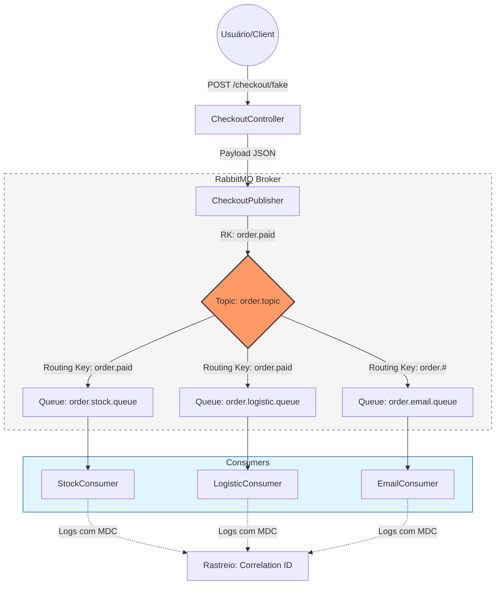

# Projeto Mensageria: Sistema de Checkout Orientado a Eventos

Este projeto é uma implementação robusta de um ecossistema de mensageria para e-commerce, focado em demonstrar padrões avançados de comunicação assíncrona, rastreabilidade e escalabilidade.

## 1. O Problema & A Solução (Visão de Produto)
Em sistemas de e-commerce tradicionais, o processamento síncrono de um pedido (pagamento, estoque, logística e notificações) cria gargalos que prejudicam a experiência do usuário e a disponibilidade do sistema.
**A Solução:** Este projeto implementa uma **Arquitetura Orientada a Eventos (EDA)** que desacopla o fechamento do pedido do seu processamento. Ao transformar uma venda em um evento assíncrono via RabbitMQ, o sistema garante que o checkout seja instantâneo, enquanto os serviços downstream (Estoque, Logística e Email) processam as informações em seu próprio ritmo, garantindo resiliência e alta taxa de transferência.

## 2. Arquitetura e Decisões Técnicas
*   **Modelo:** Monólito Modular com simulação de Microserviços via Mensageria.
*   **Comunicação:** Utiliza **RabbitMQ** com o padrão **Topic Exchange**. Esta decisão permite um roteamento flexível onde diferentes serviços podem assinar eventos específicos (ex: Logística reage apenas a pedidos pagos, enquanto o serviço de Email pode assinar todos os estados do pedido).
*   **Rastreabilidade:** Implementação de **Correlation IDs** manuais injetados nos headers das mensagens, permitindo o rastreio completo de uma transação através de múltiplos consumidores independentes.

### Fluxo da Mensagem (Event Flow)

## 3. Stack Tecnológico Detalhado
*   **Java 21 & Spring Boot 4.0.
*   **Spring AMQP (RabbitMQ):** Abstração de alto nível para integração com o message broker.
*   **Micrometer Tracing & Brave:** Implementação de observabilidade para monitoramento de latência e fluxos distribuídos.
*   **MDC (Mapped Diagnostic Context):** Utilizado para enriquecer os logs com metadados contextuais (ID de correlação, fila, domínio), facilitando o debug em produção.
*   **Java Faker:** Empregado para geração de dados sintéticos realistas em testes de carga.
*   **Logstash Logback Encoder:** Estruturação de logs em formato JSON para fácil ingestão em stacks de monitoramento (ELK).

## 4. Padrões de Projeto & Práticas de Engenharia
*   **Separation of Concerns (SoC):** Divisão clara entre Produtores (Publishers) e Consumidores (Consumers).
*   **Constants Pattern:** Centralização de nomes de filas e exchanges para evitar *magic strings* e facilitar a manutenção.
*   **DTO Pattern:** Uso de objetos de transferência de dados (`OrderEvent`) para garantir contratos de interface estáveis.
*   **Static Factory Method:** Implementação no DTO para criação de objetos "fake" de forma semântica.
*   **Clean Code:** Foco em métodos pequenos, nomes expressivos e tratamento de exceções isolado por consumidor.

## 5. Desafios Superados (Destaques Técnicos)
*   **Observabilidade em Fluxos Assíncronos:** O maior desafio em mensageria é o "lost in translation". Superei isso implementando um `LogContextHelper` que utiliza MDC para propagar o `correlation_id` do cabeçalho da mensagem para os logs, permitindo que uma única transação seja filtrada em toda a stack, mesmo que processada por threads diferentes.
*   **Simulação de Alta Disponibilidade:** Implementação de endpoints de *Stress Test* (paralelos e sequenciais) que permitem validar o comportamento do Broker sob pressão, garantindo que o sistema suporte picos de carga sem perda de mensagens.
*   **Roteamento Inteligente com Topic Exchange:** Configuração de bindings complexos onde diferentes consumidores reagem a diferentes routing keys, demonstrando conhecimento avançado em topologias de RabbitMQ para escalabilidade funcional.
*   **Resiliência e Isolamento:** Cada consumidor possui seu próprio ciclo de vida e tratamento de erro, garantindo que uma falha no serviço de Email, por exemplo, não impacte a reserva de estoque ou o despacho logístico.
