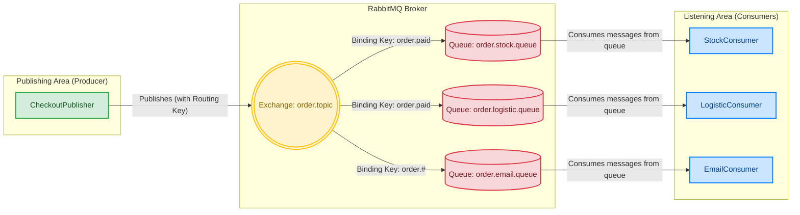

> 🌐 English | [Português](README.md)

# Mensageria — Event-Driven Checkout

I built an event-driven e-commerce checkout system to decouple order confirmation from order processing. When a sale is confirmed, the system publishes an event to RabbitMQ and responds to the client instantly, while the Stock, Logistics and Email services consume that event asynchronously and independently — each at its own pace. The project focuses on demonstrating asynchronous communication, topic-based routing, and end-to-end traceability across distributed flows.

## Features
- **Order event publishing** through a REST endpoint (`POST /checkout/fake`) that generates a synthetic order and sends it to the broker.
- **RabbitMQ Topic Exchange** (`order.topic`) with flexible routing: Stock and Logistics react to `order.paid`; Email subscribes to every order state (`order.#`).
- **Three independent consumers** (`StockConsumer`, `LogisticConsumer`, `EmailConsumer`), each with its own error handling and lifecycle.
- **Traceability with Correlation IDs**: an ID is injected into the message header on publish and propagated to the logs via MDC, making it possible to follow a transaction across every consumer.
- **Structured JSON logs** (Logstash Logback Encoder), ready for ingestion into monitoring stacks such as ELK.
- **Load-test endpoints** — sequential (`POST /checkout/stress`) and parallel (`POST /checkout/stress-parallel`) — to validate the broker under pressure.
- **RabbitMQ via Docker Compose**, with the management UI exposed.

## Tech Stack
- **Language:** Java 21
- **Backend:** Spring Boot 4.0, Spring AMQP (RabbitMQ), Spring WebMVC
- **Messaging:** RabbitMQ (Topic Exchange)
- **Observability:** Micrometer Tracing + Brave, MDC, Logstash Logback Encoder (JSON logs)
- **Test data:** Java Faker
- **Tooling:** Maven, Docker Compose

## How it works
The `CheckoutController` receives the request, generates an `OrderEvent` (with Java Faker) and serializes it to JSON. The `CheckoutPublisher` injects a unique `correlation_id` into the header and publishes the message to the `order.topic` Topic Exchange with routing key `order.paid`. From there, RabbitMQ delivers the message to the queues according to the bindings, and each consumer processes it in isolation — writing logs already enriched with the correlation ID, the queue and the domain.

## Challenges & Learnings
- **Observability in asynchronous flows:** the biggest challenge in messaging is not losing track of a transaction when it crosses different threads and consumers. I solved this with a `LogContextHelper` that extracts the `correlation_id` from the message header and propagates it to the logs via MDC — so a single transaction can be filtered across the whole stack.
- **Routing with a Topic Exchange:** I learned hands-on how to model bindings where different consumers react to different routing keys (Logistics and Stock only on `order.paid`, Email on `order.#`), which gives functional scalability.
- **Resilience through isolation:** giving each consumer its own error handling ensures that a failure in email delivery, for example, doesn't impact stock reservation or logistics dispatch.
- **Behavior under load:** the stress endpoints (sequential and parallel) helped me observe the broker under message spikes and understand the gains of asynchronous processing.

## Next steps
- Implement a **Dead Letter Queue (DLQ) with a retry policy** for messages that fail during processing.
- **Containerize the application** (its own Dockerfile) to bring broker + app up together, simplifying deployment.

## Author
Matheus de Souza Badia — [Portfolio](<https://matheusbadia.com/>)
