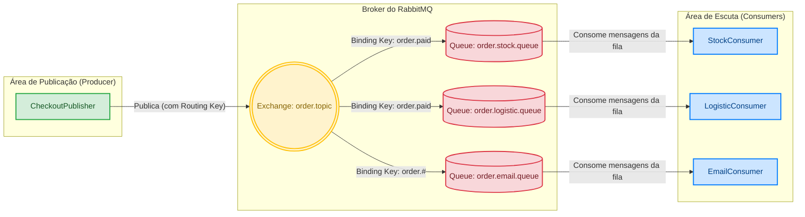

> 🌐 [English](README.en.md) | Português

# Mensageria — Checkout Orientado a Eventos

Desenvolvi um sistema de checkout de e-commerce orientado a eventos para desacoplar o fechamento do pedido do seu processamento. Quando uma venda é confirmada, o sistema publica um evento no RabbitMQ e responde instantaneamente ao cliente, enquanto os serviços de Estoque, Logística e Email consomem esse evento de forma assíncrona e independente — cada um no seu próprio ritmo. O foco do projeto é demonstrar comunicação assíncrona, roteamento por tópicos e rastreabilidade de ponta a ponta em fluxos distribuídos.

## Funcionalidades
- **Publicação de eventos de pedido** via endpoint REST (`POST /checkout/fake`), que gera um pedido sintético e o envia ao broker.
- **Topic Exchange no RabbitMQ** (`order.topic`) com roteamento flexível: Estoque e Logística reagem a `order.paid`; Email assina todos os estados do pedido (`order.#`).
- **Três consumidores independentes** (`StockConsumer`, `LogisticConsumer`, `EmailConsumer`), cada um com seu próprio tratamento de erro e ciclo de vida.
- **Rastreabilidade com Correlation ID**: um ID é injetado no header da mensagem na publicação e propagado para os logs via MDC, permitindo seguir uma transação por todos os consumidores.
- **Logs estruturados em JSON** (Logstash Logback Encoder), prontos para ingestão em stacks de monitoramento como o ELK.
- **Endpoints de teste de carga** sequencial (`POST /checkout/stress`) e paralelo (`POST /checkout/stress-parallel`) para validar o broker sob pressão.
- **RabbitMQ via Docker Compose**, com interface de gerenciamento exposta.

## Tecnologias
- **Linguagem:** Java 21
- **Backend:** Spring Boot 4.0, Spring AMQP (RabbitMQ), Spring WebMVC
- **Mensageria:** RabbitMQ (Topic Exchange)
- **Observabilidade:** Micrometer Tracing + Brave, MDC, Logstash Logback Encoder (logs JSON)
- **Dados de teste:** Java Faker
- **Ferramentas:** Maven, Docker Compose

## Como funciona
O `CheckoutController` recebe a requisição, gera um `OrderEvent` (com Java Faker) e o serializa em JSON. O `CheckoutPublisher` injeta um `correlation_id` único no header e publica a mensagem no Topic Exchange `order.topic` com a routing key `order.paid`. A partir daí, o RabbitMQ entrega a mensagem às filas de acordo com os bindings, e cada consumidor a processa de forma isolada — registrando logs já enriquecidos com o ID de correlação, a fila e o domínio.

## Desafios & Aprendizados
- **Observabilidade em fluxos assíncronos:** o maior desafio em mensageria é não perder o rastro de uma transação quando ela passa por threads e consumidores diferentes. Resolvi isso com um `LogContextHelper` que extrai o `correlation_id` do header da mensagem e o propaga para os logs via MDC — assim uma única transação pode ser filtrada em toda a stack.
- **Roteamento com Topic Exchange:** aprendi na prática a modelar bindings onde diferentes consumidores reagem a routing keys distintas (Logística e Estoque só em `order.paid`, Email em `order.#`), o que dá flexibilidade para escalar funcionalmente.
- **Resiliência por isolamento:** dar a cada consumidor seu próprio tratamento de erro garante que uma falha no envio de email, por exemplo, não impacte a reserva de estoque nem o despacho logístico.
- **Comportamento sob carga:** os endpoints de stress (sequencial e paralelo) me ajudaram a observar o broker sob picos de mensagens e entender o ganho do processamento assíncrono.

## Próximos passos
- Implementar **Dead Letter Queue (DLQ) com política de retry** para mensagens que falham no processamento.
- **Containerizar a aplicação** (Dockerfile próprio) para subir broker + app juntos, facilitando o deploy.

## Autor
Matheus de Souza Badia — [Portfólio](<a preencher>)
