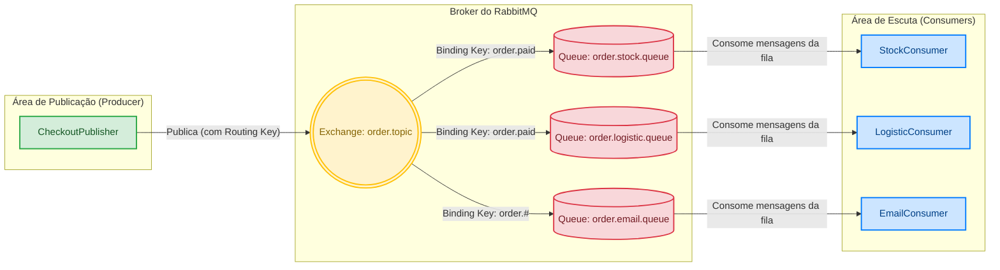

```mermaid
flowchart LR

    subgraph PROD["Área de Publicação (Producer)"]
        P[CheckoutPublisher]
    end

    subgraph BROKER["Broker do RabbitMQ"]
        E(((Exchange: order.topic)))
        
        Q_S[(Queue: order.stock.queue)]
        Q_L[(Queue: order.logistic.queue)]
        Q_E[(Queue: order.email.queue)]
        
        E -- "Binding Key: order.paid" --> Q_S
        E -- "Binding Key: order.paid" --> Q_L
        E -- "Binding Key: order.#" --> Q_E
    end

    subgraph CONS["Área de Escuta (Consumers)"]
        C_S[StockConsumer]
        C_L[LogisticConsumer]
        C_E[EmailConsumer]
    end

    P -- "Publica (com Routing Key)" --> E
    
    Q_S -- "Consome mensagens da fila" --> C_S
    Q_L -- "Consome mensagens da fila" --> C_L
    Q_E -- "Consome mensagens da fila" --> C_E

    classDef proc fill:#d4edda,stroke:#28a745,stroke-width:2px,color:#155724
    classDef mq fill:#f8d7da,stroke:#dc3545,stroke-width:2px,color:#721c24
    classDef cons fill:#cce5ff,stroke:#007bff,stroke-width:2px,color:#004085
    classDef mq_exchange fill:#fff3cd,stroke:#ffc107,stroke-width:2px,color:#856404
        
    class P proc
    class E mq_exchange
    class Q_S,Q_L,Q_E mq
    class C_S,C_L,C_E cons
```
